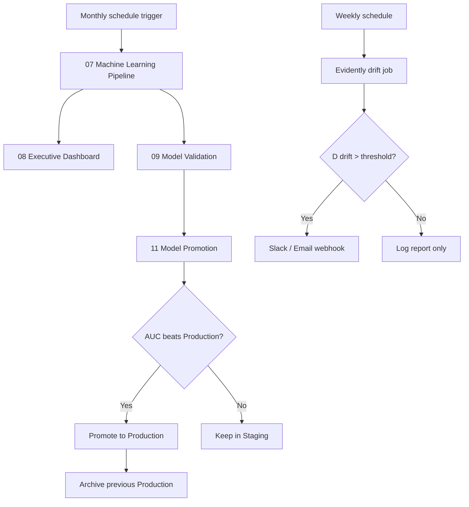

# Customer Churn Prediction & Analytics Platform

> An end-to-end Data Engineering, Machine Learning, and Business Intelligence solution built using **PySpark**, **Databricks**, **Delta Lake**, and **Spark MLlib** to identify customers at risk of churn and provide actionable business insights.

---

## Project Highlights

- End-to-End Data Engineering Pipeline
- Medallion Architecture (Bronze → Silver → Gold)
- PySpark-based ETL Pipeline
- Feature Engineering & Validation
- Random Forest Machine Learning Model
- Feature Importance Analysis
- Customer Risk Prediction
- Executive Business Dashboard
- Revenue at Risk Analysis
- Customer Personas & Business Recommendations

---

## Project Snapshot

| Metric | Value |
|--------|------:|
| Customers Analyzed | **7,043** |
| Machine Learning Model | Random Forest |
| Accuracy | **80.30%** |
| F1 Score | **79.20%** |
| ROC-AUC | **85.85%** |
| Prediction Output | Customer Risk Level |
| Business Output | Executive Dashboard |

## Business Problem

Customer churn is one of the biggest challenges faced by subscription-based businesses such as telecom companies. Losing existing customers directly impacts revenue and increases customer acquisition costs.

Traditional reporting methods identify churn after customers leave, making it difficult to take proactive action.

The goal of this project is to build an end-to-end analytics platform capable of:

- Processing raw customer data using a scalable data engineering pipeline.
- Engineering business-relevant features.
- Predicting customer churn using machine learning.
- Classifying customers into risk categories.
- Providing actionable recommendations for retention teams.
- Supporting executive decision-making through business dashboards.

## Project Objectives

- Build an end-to-end data pipeline using the Medallion Architecture.
- Perform data cleaning and validation.
- Engineer business-focused features.
- Train and evaluate a Random Forest classification model.
- Predict churn probability for all customers.
- Segment customers into High, Medium, and Low risk groups.
- Estimate revenue at risk.
- Deliver executive-ready dashboards and recommendations.

---

# Solution Architecture

The project follows a modern **Medallion Architecture** to process customer data through multiple quality layers before applying Machine Learning and Business Intelligence.

```
Raw Customer Dataset
        │
        ▼
Bronze Layer (Raw Data Ingestion)
        │
        ▼
Data Validation
        │
        ▼
Silver Layer (Clean & Standardized Data)
        │
        ▼
Business Analytics
        │
        ▼
Gold Layer (Feature Engineering)
        │
        ▼
Machine Learning Pipeline
        │
        ├── Data Preparation
        ├── Random Forest Classifier
        ├── Model Evaluation
        ├── Feature Importance
        ├── Customer Risk Prediction
        └── Model Persistence
        │
        ▼
Executive Dashboard
        │
        ├── KPI Summary
        ├── Customer Risk Segmentation
        ├── Revenue at Risk
        ├── Customer Personas
        └── Business Recommendations
```

---

# Project Workflow

The project is implemented as a modular notebook pipeline where each notebook is responsible for a single stage of the data lifecycle.

| Notebook | Purpose |
|-----------|---------|
| **01** | Data Ingestion (Bronze Layer) |
| **02** | Data Validation |
| **03** | Data Cleaning (Silver Layer) |
| **04** | Business Insights & Exploratory Analysis |
| **05** | Gold Layer & Feature Engineering |
| **06** | Feature Validation & Selection |
| **07** | Machine Learning Pipeline |
| **08** | Executive Dashboard & Business Intelligence |
| **09** | Model Validation & Prediction Analysis |

---

# Technology Stack

| Category | Technology |
|-----------|------------|
| Programming Language | Python |
| Data Processing | PySpark |
| Platform | Databricks |
| Storage | Delta Lake |
| Machine Learning | Spark MLlib |
| Model | Random Forest Classifier |
| Query Language | SQL |
| Data Analysis | Spark DataFrame API |
| Visualization | Databricks Visualizations |

---

# Dataset Information

The project uses the **Telco Customer Churn Dataset**, which contains customer demographics, account information, subscribed services, billing details, and churn status.

### Dataset Summary

| Attribute | Value |
|-----------|------:|
| Total Customers | **7,043** |
| Original Features | **21+** |
| Engineered Features | **5+** |
| Target Variable | **Churn** |

---

# Medallion Architecture

### 🥉 Bronze Layer

- Raw CSV ingestion
- Initial schema creation
- Raw data preservation
- Delta Table creation

---

### 🥈 Silver Layer

- Data cleaning
- Data type conversion
- Missing value handling
- Standardized dataset generation

---

### 🥇 Gold Layer

- Business feature engineering
- Customer segmentation features
- ML-ready dataset creation
- Optimized analytical dataset

---

# Feature Engineering

Several business-driven features were engineered to improve model performance and interpretability.

### Engineered Features

- **HasFamily**
- **IsLongTermContract**
- **TotalServicesSubscribed**
- **MonthlyChargeLevel**
- **TenureGroup**

These engineered features help the model capture customer behavior more effectively than using raw attributes alone.

---

---

# Machine Learning Pipeline

The Machine Learning pipeline was implemented using **Spark MLlib** to support scalable model training and prediction on large datasets.

## Pipeline Stages

```
Gold Dataset
      │
      ▼
Categorical Encoding
      │
      ▼
Feature Vector Creation
      │
      ▼
Train / Test Split
      │
      ▼
Random Forest Classifier
      │
      ▼
Model Evaluation
      │
      ▼
Feature Importance
      │
      ▼
Customer Risk Prediction
      │
      ▼
Prediction Report
```

---

# Model Performance

The Random Forest Classifier achieved strong predictive performance on the customer churn dataset.

| Metric | Score |
|---------|------:|
| Accuracy | **80.30%** |
| F1 Score | **79.20%** |
| ROC-AUC | **85.85%** |

These metrics indicate that the model provides reliable churn predictions while maintaining a good balance between precision and recall.

---

# Feature Importance

The trained Random Forest model identified the following features as the most influential for customer churn prediction.

| Rank | Feature |
|-----:|---------|
| 1 | Contract Type |
| 2 | Monthly Charges |
| 3 | Tech Support |
| 4 | Long-Term Contract |
| 5 | Internet Service |

These results align with the business insights discovered during exploratory analysis, increasing confidence in the model's predictions.

---

# Prediction Validation

To ensure that the model generated meaningful predictions, a validation phase was conducted after model deployment.

## Validation Results

✅ High-risk customers were predominantly **Month-to-Month** subscribers.

✅ High-risk customers had the **highest average monthly charges**.

✅ High-risk customers had the **lowest average tenure**.

✅ Long-term customers were primarily classified as **Low Risk**.

The prediction results were consistent with known telecom customer behavior and supported business expectations.

---

# Executive Dashboard

An executive dashboard was developed to convert model predictions into actionable business insights.

### Dashboard Features

- Executive KPI Summary
- Customer Risk Segmentation
- Contract-wise Risk Analysis
- Revenue at Risk Analysis
- Customer Personas
- Business Recommendations

The dashboard enables business users to identify high-risk customers, prioritize retention campaigns, and monitor customer churn trends.

---

# Business Impact

The project transforms raw customer data into business intelligence that supports proactive decision-making.

## Business Outcomes

- Identified customers at high risk of churn.
- Generated personalized retention recommendations.
- Estimated revenue at risk from potential customer loss.
- Delivered executive-ready dashboards for decision-makers.
- Improved explainability through feature importance analysis.

Instead of reacting after customers leave, the organization can take proactive measures to improve customer retention.

---

---

# Repository Structure

```
Customer-Churn-Prediction-Analytics-Platform/
│
├── architecture/
├── dashboard/
├── data/
│   ├── raw/
│   └── processed/
├── models/
├── notebooks/
│   ├── 01_Data_Ingestion.ipynb
│   ├── 02_Data_Validation.ipynb
│   ├── 03_Data_Cleaning.ipynb
│   ├── 04_Business_Insights_Analysis.ipynb
│   ├── 05_Gold_Layer_&_Feature_Engineering.ipynb
│   ├── 06_Feature_Validation_&_Selection.ipynb
│   ├── 07_Machine_Learning_Pipeline.ipynb
│   ├── 08_Executive_Dashboard_&_Business_Intelligence.ipynb
│   └── 09_Model_Validation_&_Prediction_Analysis.ipynb
│
├── presentation/
├── reports/
├── screenshots/
├── src/
├── README.md
├── Project_Structure.md
├── requirements.txt
├── .gitignore
└── LICENSE
```

---

# Challenges Faced

Developing an end-to-end analytics platform involved solving several real engineering challenges beyond building a machine learning model.

## Technical Challenges

- Converting `TotalCharges` from string to numeric while handling missing values.
- Designing a Medallion Architecture using Bronze, Silver, and Gold data layers.
- Building reusable preprocessing and validation modules.
- Managing Spark ML pipelines within Databricks.
- Saving trained models using Unity Catalog Volumes after DBFS restrictions.
- Ensuring prediction reports covered all **7,043 customers**, not only the test dataset.
- Validating business recommendations against customer profiles.

These challenges strengthened the reliability and maintainability of the final solution.

---

# Future Enhancements

Possible future improvements include:

- Real-time churn prediction using Structured Streaming.
- Interactive dashboards using Power BI or Tableau.
- Customer lifetime value prediction.
- Personalized retention strategy recommendations.

**Now implemented (Phase 6):** automated drift monitoring, CI/CD, MLflow model promotion gate, and scheduled retraining workflow documentation — see [MLOps](#mlops-production-operations) below.

**Also included (Phase 7):** a deliberately separate Document Q&A tool for manuals, PDFs, Markdown, and public GitHub documentation. It does not use customer data or participate in the churn prediction pipeline.

---

# MLOps (Production Operations)

Phase 6 adds production ML practices: drift monitoring, CI/CD, champion/challenger model promotion, unit tests, and a documented retraining DAG.

## Drift monitoring (Evidently)

Compare incoming feature distributions against the training baseline weekly:

```bash
python scripts/run_drift_monitor.py \
  --reference data/reference/gold_train_sample.parquet \
  --current data/incoming/gold_latest.parquet \
  --alert
```

- HTML reports saved under `reports/drift/`
- Alert when drift share exceeds **25%** (`DRIFT_ALERT_THRESHOLD` in `src/config/settings.py`)
- Set `ML_ALERT_WEBHOOK_URL` for Slack/Teams notifications

**Databricks weekly job:** schedule `scripts/run_drift_monitor.py` with cluster task; pass reference snapshot from Gold training partition and current from latest Gold table export.

## CI/CD (GitHub Actions)

On every push/PR, `.github/workflows/ci.yml` runs:

1. **Ruff** lint on `src/`, `tests/`, `app/`, `scripts/`
2. **py_compile** on all `notebooks/*.py` Databricks sources
3. **pytest** on pipeline modules (ingestion, preprocessing, model registry logic)

Local equivalent:

```bash
pip install -r requirements.txt -r requirements-dev.txt
make ci
```

## Model registry lifecycle (MLflow)

| Stage | Meaning |
|-------|---------|
| **Staging** | Newly trained challenger model |
| **Production** | Live model serving predictions |
| **Archived** | Retired champion after promotion |

**Notebook 11 — Model Promotion** (`notebooks/11_Model_Promotion.py`) promotes a challenger to Production **only if** its held-out ROC-AUC beats the current Production model (champion/challenger gate).

Widgets: `challenger_run_id`, `challenger_auc`, `min_auc_improvement`

## Unit tests

| File | Coverage |
|------|----------|
| `tests/test_ingestion.py` | CSV/Parquet loaders, URL/slug parsing |
| `tests/test_preprocessing.py` | Silver cleaning + validation helpers (chispa) |
| `tests/test_model_registry.py` | Champion/challenger decision logic |

## Scheduled retraining — Databricks Workflow DAG

Monthly retraining runs notebooks in dependency order:



**Task dependencies (Databricks Jobs):**

| Task | Notebook / Script | Depends on |
|------|-------------------|------------|
| Train | `07_Machine_Learning_Pipeline` | — |
| Dashboard | `08_Executive_Dashboard_&_Business_Intelligence` | Train |
| Validate | `09_Model_Validation_&_Pred_Analysis` | Train |
| Promote | `11_Model_Promotion` | Validate |
| Drift (weekly) | `scripts/run_drift_monitor.py` | — |

Configure the promotion task to pass `challenger_run_id` and `challenger_auc` from notebook 07's MLflow run output.

---

# Document Q&A (Phase 7)

The Streamlit sidebar includes **Ask Your Documents**, a general-purpose RAG module kept separate from the churn analytics workflow. It accepts PDF, Markdown, text, and reStructuredText uploads, or documentation from a public GitHub repository.

```bash
pip install -r requirements.txt -r requirements-rag.txt
streamlit run app/streamlit_app.py
```

The module extracts text, splits it into approximately 500-word chunks with a 50-word overlap, embeds those chunks with `all-MiniLM-L6-v2`, and stores them in a local Chroma collection under `data/rag/chroma/`. Questions retrieve the most relevant chunks and Gemini answers strictly from that evidence. Each response displays the source filename or GitHub path, plus PDF page and chunk number when available.

Set `GEMINI_API_KEY` in `app/.env` before asking questions. Scanned PDFs need OCR before upload because they contain no extractable text.

---

# Learning Outcomes

This project provided practical experience in:

- Data Engineering with PySpark
- Delta Lake & Medallion Architecture
- Feature Engineering
- Machine Learning using Spark MLlib
- Business Intelligence & Dashboard Development
- Model Explainability
- Data Validation & Quality Assurance
- End-to-End Analytics Platform Development

---

# Project Status

## ✅ Completed

- Data Engineering Pipeline
- Data Validation
- Data Cleaning
- Business Analytics
- Feature Engineering
- Machine Learning Pipeline
- Feature Importance Analysis
- Customer Risk Prediction
- Executive Dashboard
- Business Validation
- Revenue at Risk Analysis
- MLOps: Drift monitoring, CI/CD, model promotion gate, unit tests

---

# Key Takeaways

This project demonstrates how Data Engineering, Machine Learning, and Business Intelligence can be integrated into a single analytics platform.

Instead of focusing only on model accuracy, the project emphasizes business value by transforming customer data into actionable insights that support retention strategies and executive decision-making.

---

# Author

**Shivek Singh**

Data Analyst | Data Science Enthusiast

### Tech Stack

- Python
- PySpark
- Databricks
- Spark MLlib
- Delta Lake
- SQL

---

⭐ If you found this project interesting, consider giving the repository a star.


---

# Version 2 — Streamlit Product Layer

Version 2 evolves the completed analytics/ML foundation into a business-facing application. The V2 application is designed to run without Databricks for the interactive demo path and uses the existing analytics logic in `app/analytics.py`.

## Local Run

```bash
python -m venv .venv
# Windows: .venv\\Scripts\\activate
# macOS/Linux: source .venv/bin/activate
pip install -r requirements.txt
streamlit run app/streamlit_app.py
```

## Optional AI / RAG

Install `requirements-rag.txt` only when using the document RAG features. Put the Gemini key in Streamlit Cloud Secrets rather than committing it to GitHub.

```toml
GEMINI_API_KEY = "your-key"
GEMINI_MODEL = "gemini-2.5-flash"
```

## Streamlit Cloud

- Repository: this GitHub repository
- Main file: `app/streamlit_app.py`
- Python: 3.11+
- Core deployment does not require a Databricks connection.
- Do not commit API keys, `.env` files, local Chroma databases, or large generated artifacts.

## V2 Product Roadmap

1. Deployment-ready foundation
2. Smart upload and validation
3. V1 prediction-engine integration
4. Executive dashboard
5. Customer explorer and explanations
6. AI business insights
7. Revenue-at-risk and retention simulation
8. PDF/Excel report center
9. Testing, performance, and UI polish

The principle is to add features only when they solve a real customer-retention or business-analysis problem.
